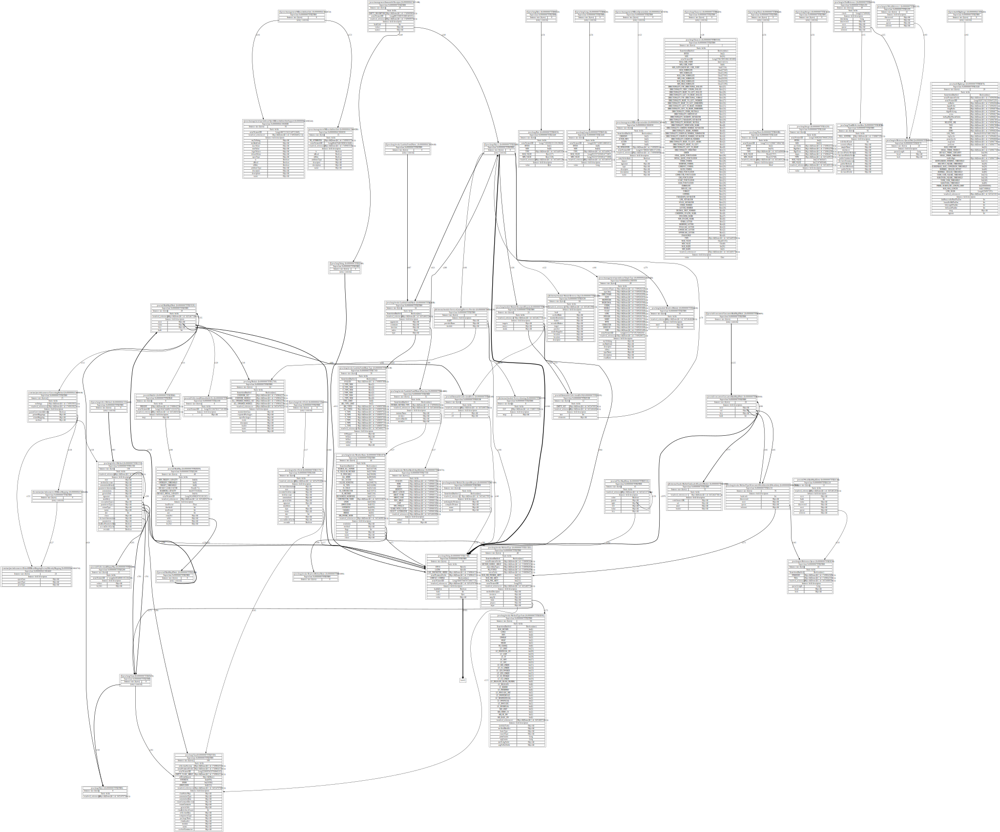
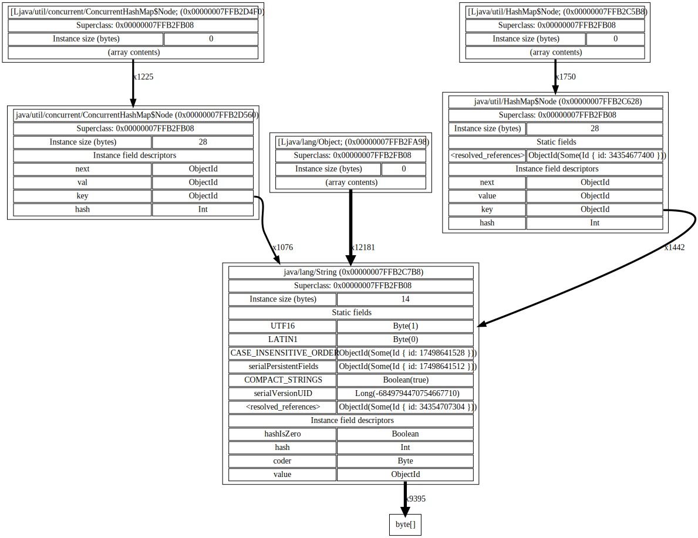

[](https://crates.io/crates/jvm-hprof) [](https://docs.rs/jvm-hprof/)

A parsing library for the [`hprof`](https://github.com/openjdk/jdk/blob/08822b4e0526fe001c39fe08e241b849eddf481d/src/hotspot/share/services/heapDumper.cpp) file format, which is used for JVM heap dumps.

The library is available as a [crate](https://crates.io/crates/jvm-hprof). A number of tools built on top of the library are available in `examples/` that may be of interest as ready-to-go tools (particularly `ref-count-graph`, see Tools below) or as starting points for your own tools.

# Example

If you don't have the Rust toolchain, install [rustup](https://rustup.rs/), which installs the latest stable compiler by default.

Use one of the tools provided by the `analyze_hprof` example, in this case producing a CSV of the instance count for each class in a heap dump.

```
cargo run --release --example analyze_hprof -- \
 -f path/to/heapdump.hprof -t 4 \
instance-counts 
```

produces

```
Instance count,Instance size (bytes),Total shallow instance size (bytes),Class name,Class obj id
114608,14,1604512,java/lang/String,34350304416
100000,24,2400000,java/util/LinkedList$Node,34350511968
2319,28,64932,java/util/HashMap$Node,34350382296
2045,0,0,[Ljava/lang/Object;,34350326864
2010,28,56280,java/util/concurrent/ConcurrentHashMap$Node,34350383896
...
```

If you have very fast storage and a large enough heap dump to notice the difference, try increasing the number of threads used for parsing (`-t`).

# Performance

The library parses the `mmap`'d contents of an hprof file. This allows parsing enormous heap dumps without being constrained by the available system memory, as well as mostly zero-copy parsing. Parsing a `Utf8` record type, for instance, results in a stack-allocated struct with an 8-byte id and a `&[u8]` slice that simply points into the mapped file contents. 

It would be interesting to push the zero-copy part further by making even ids simply read from the underlying slice, though in some cases there are tag-length-value style encodings used so some parsing does have to be done up front.

Since larger heap dumps are broken up into 2GiB segments, any heap dump large enough to take a noticeable time to parse can be processed in parallel, and a handful of cores will saturate even fast NVMe storage's read throughput. The `instance-count` tool (see below), for instance, is parallelized and parses heap dumps at 2100-2200MiB/s with 4x 3.5GHz Broadwell cores on an NVMe drive rated for 600,000 IOPS random read at 4KiB (~2300MiB/s). By 6 cores, the drive is completely saturated.

# Tools

There are a number of tools available as subcommands via the `analyze_hprof` example, a few of which are described in more detail below. To see the available subcommands:

```
cargo run --release --example analyze_hprof -- help
```

Top level args, which are followed by the chosen subcommand:

- `-f` - the hprof file to parse
- `-t` - optional; the number of threads to use (for tools that parallelize)

Some tools produce `dot` files to be used with [Graphviz](https://graphviz.org/).

## Subcommand: `build-index`

Some tools need to look up the class id for each object id. Keeping a separate on-disk index rather than building an in-memory map allows processing very large heap dumps that would otherwise require prohibitive amounts of memory to keep track of billions of object ids.

To create an index for a heap dump:

```
cargo run --release --example analyze_hprof -- \
    -f path/to/your.hprof \
    build-index \
    -o path/to/index
```

## Subcommand: `ref-count-graph`

Rather than producing a graph of individual objects and the reference relationships between them, this graphs the class relationships between them.

Consider classes `Foo` and `Bar`, where `Foo` has a field `b` of type `Bar` (never null). If there are 172893 instances of `Foo` (and `Bar`), instead of having a graph with 172893 nodes for `Foo` objects depicted in it, and another 172893 nodes for the `Bar` objects that the `Foo`s refer to, there will be two nodes: one for `Foo` and one for `Bar`, with an edge between them with a weight of 172893. This way, patterns of object relationships pop out visually even on huge heap dumps that would be intractable to inspect object by object.

`--min-edge-count` sets the threshold for how many references there must be from a given field to another type for it to be included in the graph. Smaller numbers will show more nodes in the graph at the cost of more visual clutter.

This is the output produced with `--min-edge-count 100` on the heap dump of a newly started JVM:

[](doc/ref-count-empty-100.svg)

And with `--min-edge-count 1000`, aggressively filtering away less common edges:

[](doc/ref-count-empty-1000.svg)

To produce the graph, first build an index for your hprof as shown above, then use it with `--index`:

```
cargo run --release --example analyze_hprof -- \
    -f path/to/your.hprof \
    ref-count-graph \
    --index path/to/index \
    --min-edge-count 50 \
    -o path/to/ref-count.dot
    
dot -Tsvg path/to/ref-count.dot -o path/to/ref-count.svg
```


## Subcommand: `instance-counts`

Output a CSV of the instance count for each class, ordered by count.

```
cargo run --release --example analyze_hprof -- \
    -f path/to/your.hprof \
    instance-counts
```

## Subcommand: `class-hierarchy`

Ever wanted to know the class inheritance hierarchy for every loaded class in visual form? Wonder no more. The tool produces a `.dot` description of a graph, which is then rendered with GraphViz's `dot`.

```
cargo run --release --example analyze_hprof -- \
    -f path/to/your.hprof \
    class-hierarchy \
    -o path/to/class-hierarchy.dot
    
dot -Tsvg path/to/class-hierarchy.dot -o path/to/class-hierarchy.svg
```

## Subcommand: `dump-objects`

When you just want to see the data in every field of every object.

```
cargo run --release --example analyze_hprof -- \
    -f path/to/your.hprof \
    dump-objects
```

## Generating sample heaps

The `sample-dump-tool` sub-directory can generate a few different shapes of object graph for your heap analysis amusement. 

To see the available subcommands:

```
cd sample-dump-tool
./gradlew run
```

And to generate an .hprof that shows different collection types, for example:

```
./gradlew run --args collections
```

# Why write a JVM heap dump tool in Rust?

I worked a little bit with (and on) [jheappo](https://github.com/AdoptOpenJDK/jheappo), a conceptually-similar library written in Java, which was fun, but left me wanting more:

- It was based on `InputStream`, so parsing couldn't trivially be parallelized, and required copying all data several times
- Each parsed record was heap-allocated, which was convenient, but not always desirable (GC pressure, constantly flushing the  cache, etc)
- Java object overhead for each parsed object meant that accumulating collections of info on objects, etc, took up more memory than it otherwise might
- Hprof uses unsigned numeric types in a number of places, which Java can't natively represent
- Algebraic data types / sum types are nice when using or writing parsers, but Java doesn't have them

Zero-copy parsing in Rust had been on my to-do list for a while, and I had a > billion object heap dump to investigate that crushed every existing heap dump analysis tool I could find, so...
